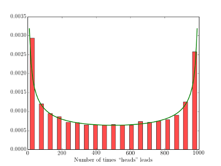

У теорії ймовірностей арксинусним розподілом називається розподіл ймовірностей, 
кумулятивна функція розподілу якого включає в себе арксинус і квадратний корінь:
 

 для 0 ≤ х ≤ 1, і щільність розподілу ймовірностей якого має вигляд:
 

 
на (0, 1).
 
приклад графіку функції розподілу:
 
